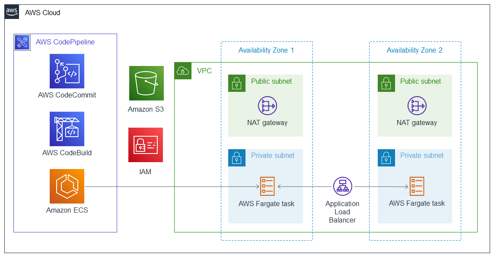

:xrefstyle: short

Deploying this Quick Start for a new virtual private cloud (VPC) with
default parameters builds the following {partner-product-short-name} environment in the
AWS Cloud.

// Replace this example diagram with your own. Follow our wiki guidelines: https://w.amazon.com/bin/view/AWS_Quick_Starts/Process_for_PSAs/#HPrepareyourarchitecturediagram. Upload your source PowerPoint file to the GitHub {deployment name}/docs/images/ directory in this repo. 

[#architecture1]
.Quick Start architecture for {partner-product-short-name} on AWS

As shown in <<architecture1>>, the Quick Start sets up the following:

* A highly available architecture that spans two Availability Zones.
* A VPC configured with public and private subnets, according to AWS
best practices, to provide you with your own virtual network on AWS.
* AWS CodePipeline to create a pipeline with source, build, and deploy stages. The pipeline is invoked when a developer commits a code change to the CodeCommit repository.
** AWS CodeCommit to host the application source code in a Git repository.
** AWS CodeBuild to serve as a CodePipeline stage for performing the build process for a container image.
** Amazon Elastic Container Service (Amazon ECS) to deploy the updated application container image. 
* Amazon Simple Storage Service (Amazon S3) to store AWS CodePipeline artifacts.
* AWS Identity and Access Management (IAM) roles for the CI/CD pipeline's build and deployment process.
* In the public subnets, managed network address translation (NAT) gateways to allow outbound
internet access for resources in the private subnets.
* In the private subnets:
** AWS Fargate tasks to host the containers using Amazon ECS.
** An Application Load Balancer to direct traffic to the Fargate cluster.
